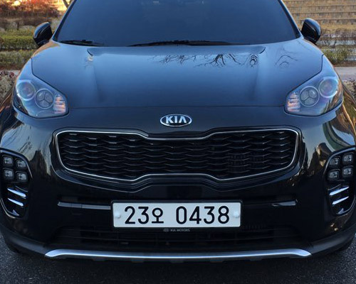
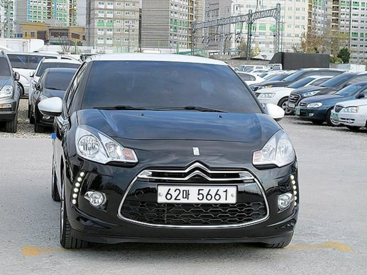

# 차량 번호판 인식 시스템(Auto Number Plate Recognition)

> OpenCV와 pytesseract를 활용한 차량 번호판 자동 인식 프로젝트
> 이미지 전처리를 통해 번호판을 감지하고, OCR로 텍스트를 추출하여 차량 정보를 인식합니다.

---

## 🧠 프로젝트 개요
- 📌 목표:
딥러닝 모델이 아닌 OpenCV와 Tesseract 같은 전통적인 라이브러리를 활용하여 다양한 이미지 전처리 기법을 직접 실습하고 이해하는 것이 1차적인 목표입니다.
또한, 다양한 촬영 환경(조도, 각도, 거리 등)에서 촬영된 차량 이미지로부터 번호판 영역을 자동으로 검출하고, 텍스트를 정확히 추출하는 전체 인식 과정을 구현하는 것을 최종 목표로 합니다.
- 🛠️ **사용 기술**:
- OpenCV (이미지 전처리, 윤곽선 탐지 등)
- pytesseract (OCR 텍스트 인식)
- python
- 👉 **환경**
- Window 11 Home
- Visual Studio Code
- AMD Ryzen 7 7735HS with Radeon Graphics
- Ram 32GB

---

## 📁 프로젝트 구조
OPEN_CV_프로젝트/ 
├── anpr.py # 메인 실행 파일 (번호판 인식 전체 프로세스) 
├── images/ # 테스트용 이미지 폴더 
├── README.md # 프로젝트 설명 
├── .gitignore 
├── .gitmessage.txt 
└── .trunk/ # 코드 규칙 설정 (코드 스타일링 도구 관련) 
├── configs/ 
├── tools/ 
└── trunk.yaml

---
## 실행 방법

### 1. 패키지 설치
pip install opencv-python pytesseract

### 2. Tesseract 설치(윈도우)
- 공식 설치 링크: https://github.com/tesseract-ocr/tesseract

### 3. 실행
- Visual Studio Code를 통해 실행
- 프로젝트 폴더 진입 후 터미널에서 열기 후 python anpr.py

---

## 🧪예시 결과
| 원본 이미지             | 인식 결과          |
| ------------------ | -------------- |
|  | '23오0438'     |
|  | `62마5661` |

---

## 🧩구현 내용 요약
- Grayscale, GaussianBlur, AdaptiveThreshold 등을 통한 전처리
- Contour 기반 번호판 후보 탐지
- pytesseract를 활용한 OCR 및 정규표현식 후처리
- 번호판 텍스트 유효성 검사

---

## 🛠️ 개발 중 겪은 문제 & 해결 방법
| 문제           | 해결 방법                            |
| ------------ | -------------------------------- |
| OCR 정확도 낮음   | 전처리 조정 + OCR 영역 리사이즈 + 정규표현식 필터링 |
| 번호판 영역 검출 실패 | 윤곽선 조건 개선, 가로세로 비율 제한 적용         |
| 택시 번호판 인식 오류 | 추출된 텍스트의 첫글자가 숫자가 아닐 경우 제거         |
| 등록번호 추출 오류 | 텍스트의 길이가 번호판 길이(구형 7자리, 신형 8자리) 초과시 제거         |

---
## 🔧 추후 보완점
딥러닝 기반 라이브러리를 사용하지 않고 OpenCV와 Tesseract만으로 구현하다 보니, 사람이 보기엔 명확한 번호판이라도 Tesseract가 제대로 인식하지 못하는 경우가 자주 발생했습니다.
또한, 이미지 크기가 너무 클 경우 OCR 인식률이 낮아지는 문제를 해결하기 위해 크기를 줄이는 전처리를 적용했지만, 오히려 화질 저하로 인해 인식이 더 어려워지는 사례도 있었습니다.

이후에 정확도를 높이고 싶다면 전처리 중심의 접근 대신, YOLO와 같은 딥러닝 기반 객체 탐지 모델을 활용하여 번호판을 검출하고, EasyOCR과 같은 강력한 딥러닝 기반 OCR 라이브러리를 적용해 전체적인 인식 정확도를 높이는 방향으로 개선해 나갈 계획입니다.

---
## 🔗 참고 자료
- https://github.com/kairess/license_plate_recognition
## 📃 라이선스
MIT License
